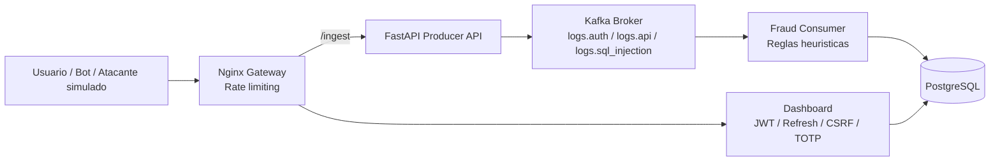
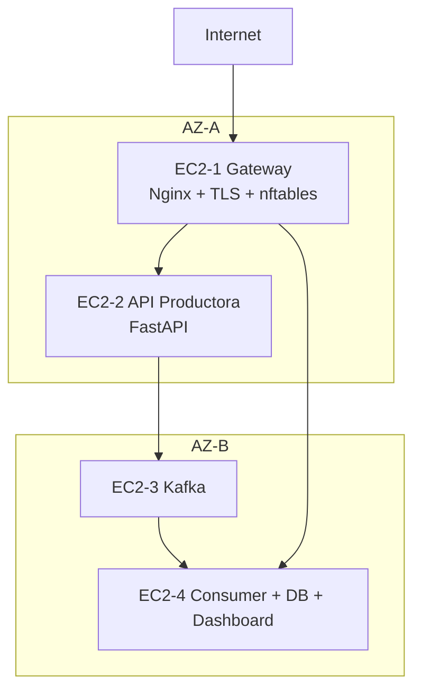

# Diagrama

```mermaid
flowchart LR
    user[Usuario / Bot / Atacante simulado]
    gateway[Nginx Gateway\nRate limiting]
    api[FastAPI Producer API]
    kafka[Kafka Broker\nlogs.auth / logs.api / logs.sql_injection]
    consumer[Fraud Consumer\nReglas heuristicas]
    db[(PostgreSQL)]
    dashboard[Dashboard\nJWT / Refresh / CSRF / TOTP]

    user --> gateway
    gateway -->|/ingest| api
    api --> kafka
    kafka --> consumer
    consumer --> db
    dashboard --> db
    gateway --> dashboard
```

## Distribucion EC2 sugerida

```mermaid
flowchart TB
    subgraph aza[AZ-A]
        gw[EC2-1 Gateway\nNginx + TLS + nftables]
        api[EC2-2 API Productora\nFastAPI]
    end

    subgraph azb[AZ-B]
        kafka[EC2-3 Kafka]
        app[EC2-4 Consumer + DB + Dashboard]
    end

    internet[Internet] --> gw
    gw --> api
    api --> kafka
    kafka --> app
    gw --> app
```
